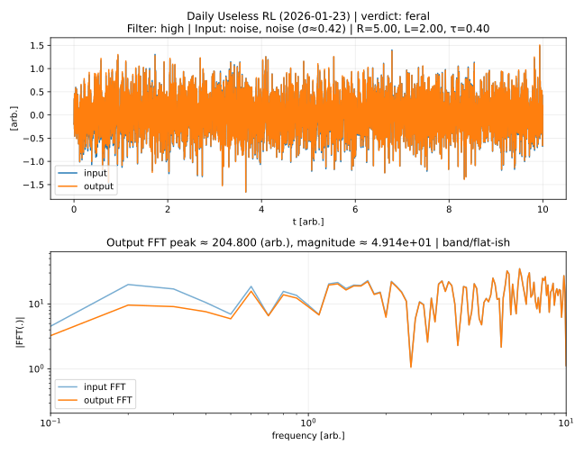

# Daily Useless Physics

Every day, GitHub Actions generates a **random dynamical system**
and excites it with a **random input signal**.

## Today's Result (2026-01-18)

- **System**: RLC
- **Parameters**: R=10.00, L=10.00, C=1.00, ωn=0.32, ζ=1.58
- **Input**: noise (σ≈0.71)

### Useless judgement
- **verdict**: **feral**（だいぶ暴れた）
- overshoot-ish: 0.086
- wiggles: 150
- FFT peak (output): 0.100 (arb.)

> A resonance-like thing happened. Please do not ask why.

