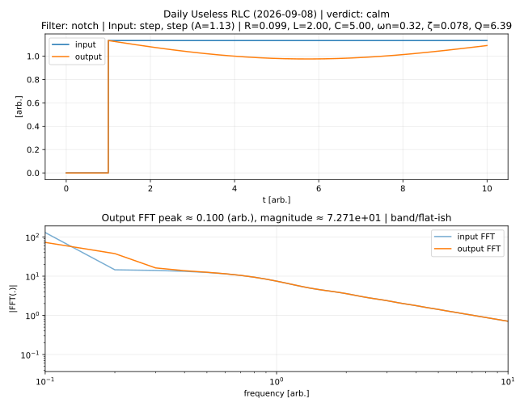

# Daily Useless Physics

Every day, GitHub Actions generates a **random dynamical system**
and excites it with a **random input signal**.

## Today's Result (2026-09-07)

- **System**: RC
- **Filter kind (random by system)**: high
- **Parameters**: R=0.50, C=0.50, τ=0.25
- **Input**: square (A=1.25, f=0.81 Hz)

### Useless judgement
- **verdict**: **feral**
- overshoot-ish: 1.035
- wiggles: 17
- FFT peak (output): 0.800 (arb.)
- rough shape guess from |Y|/|X|: band/flat-ish

> We observed a rare event: uncontrolled confidence.

